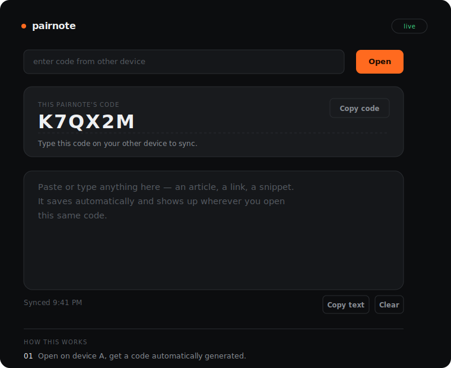

# Pairnote

**Got something on one device that you need on another? Type a code, and it's there.**

No login. No URL to send yourself. No emailing a snippet just to get it from your laptop to your phone. Pairnote is a tiny clipboard that follows you between your own devices, using nothing but a short code you can remember.

🔗 **Try it now:** [balkrishnashah.github.io/pairnote](https://balkrishnashah.github.io/pairnote/)

---

## What it actually does

You're working on your laptop and need that paragraph, link, or snippet on your phone. Normally that means messaging yourself, emailing a file, or copying through some chat app just to bridge two screens you own.

Pairnote skips all of that. Open the page, it hands you a six-character code. Open the same page anywhere else, type that code in, and your text is right there — synced live, in both directions, for as long as you need it.

## How to use it

**On your first device**
1. Open the page. A code appears automatically — something like `K7QX2M`.
2. Type or paste whatever you want to move into the box.
3. That's it. It saves on its own as you type.

**On your other device**
1. Open the same page.
2. Type that code into the **enter code** field at the top.
3. Tap **Open**. Your text is already there.

Keep editing from either side and both stay in sync while the tabs are open. Come back tomorrow and the code is still remembered on each device, so you won't need to re-enter it unless you're connecting a brand new one.

## Who this is for

People who own more than one device and are tired of the small friction of moving text between them. Not built for sharing with other people — it's a personal relay, not a messaging tool.

## A quick note on privacy

There's no account and no password — the code itself is the key. That keeps things simple, but it also means anyone who has your code can read or edit that note. Treat the code the way you'd treat a sticky note on your desk: fine for links, drafts, and snippets; not the place for passwords or anything truly sensitive.

---

Built for one person, on one bad Wi-Fi connection, trying to get a paragraph from a laptop to a phone without opening five apps to do it.